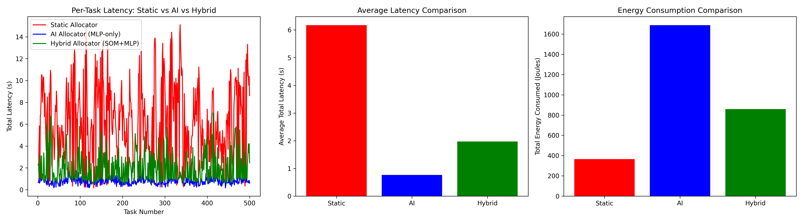

Energy-Aware Resource Allocation in 6G LEO-Edge NetworksA Hybrid Soft Computing & Automata-Driven Architecture🌟 Live Interactive Dashboard: [Insert Your Streamlit App URL Here]AbstractNext-generation 6G networks necessitate a seamless terrestrial-satellite computing continuum. However, dynamic IoT traffic and the high mobility of Low Earth Orbit (LEO) satellites render static routing heuristics inefficient, causing severe latency bottlenecks. While deep learning models offer predictive routing, continuous inference on resource-constrained IoT edge devices introduces prohibitive computational and energy overheads.This project proposes a "Green 6G" hybrid soft computing architecture utilizing a Kohonen Self-Organizing Map (SOM) coupled with Multi-Layer Perceptrons (MLP) and a Deterministic Finite Automaton (DFA) safety governor. The simulation demonstrates that this hybrid framework reduces AI energy consumption by ~65% while maintaining a highly stable average system latency, providing a viable, power-efficient solution for dynamic task offloading in extreme-edge environments.System ArchitectureThis framework replaces standard static routing with a three-tier intelligent multi-objective allocator:The Energy Gatekeeper (Kohonen SOM): An ultra-lightweight ($0.1$ J/task) unsupervised Self-Organizing Map continuously monitors the network state (edge queue, task size, satellite latency). During low-stress periods, the SOM confidently routes tasks to the terrestrial Edge, intentionally bypassing heavy ML models to conserve battery life.The Predictive Engine (Multi-Layer Perceptron): Triggered only when the SOM detects network congestion, two parallel MLPs ($1.2$ J/task) calculate the exact predicted latency for both the Edge and the LEO satellite, dynamically routing the packet to the fastest node.The Oscillation Governor (DFA): To prevent network instability (the "Ping-Pong Effect"), a Deterministic Finite Automaton monitors the AI's routing sequences. If rapid route switching is detected within a 5-task window, the DFA transitions states ($q_0 \rightarrow q_1 \rightarrow q_2$), explicitly overriding the neural network and forcing a LEO offload cool-down period to stabilize the network.Performance & ResultsThe architecture was benchmarked using a Python-based discrete-event simulation (SimPy) processing 1000 bursty IoT tasks.(Note: Upload your 3-panel PNG graph to the repository and link it here!)Key Findings:Latency Reduction: The Hybrid architecture maintained a highly stable average latency of ~2.0s, completely mitigating the extreme bottlenecking observed in the static allocator (which suffered an average latency > 6.0s).Green 6G Efficiency: By utilizing the SOM gatekeeper, the system bypassed MLP inference ~65% of the time, resulting in a massive reduction in total AI energy consumption compared to a pure MLP approach.Inherent Stability: The system demonstrated high natural resistance to routing oscillation, requiring 0 forced DFA overrides under standard highly-congested 6G traffic conditions.Installation & Local DeploymentTo run the simulation and interactive web dashboard locally:1. Clone the repositoryBashgit clone https://github.com/Alien0427/6G-Edge-Routing-Simulation.git
cd 6G-Edge-Routing-Simulation
2. Install dependenciesBashpip install -r requirements.txt
3. Run the interactive Streamlit dashboardBashstreamlit run app.py
Technologies UsedSimulation: SimPySoft Computing: scikit-learn (MLP Regressors), minisom (Kohonen Networks)Web UI: StreamlitData & Visualization: Pandas, NumPy, Matplotlib

